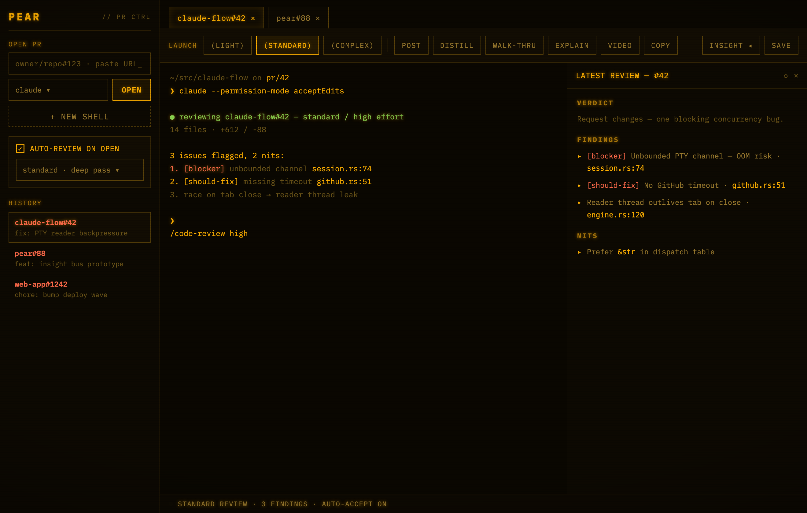

<div align="center">

# 🍐 peaR

**A terminal-native PR review control center.**
Every pull request is a tab. Every tab is a real terminal running the AI CLI of your choice.
Review with one keystroke, resume any past session, and keep your reviews close.

[](https://github.com/imbgar/pear/actions/workflows/ci.yml)
[](https://github.com/imbgar/pear/releases)
[](./LICENSE)
[](#install)
[](https://tauri.app)



<sub>Phosphor theme. One click toggles to <b>Instrument</b> — see <a href="docs/design-mocks/1-instrument.png">the other look</a>.</sub>

</div>

---

## Why peaR

Reviewing PRs with an AI CLI means a lot of `gh pr checkout`, juggling terminal panes, and
losing the conversation the moment you close a tab. **pear** makes the PR the unit of work:

- 🗂️ **PRs as tabs** — open `owner/repo#123` (or paste a GitHub URL); pear finds the repo
  locally, checks out the branch, and drops you into a real terminal there.
- 🤖 **Bring your own CLI** — `claude`, `codex`, `aider`, or a plain shell, per tab.
- 🚀 **One-keystroke reviews** — Light / Standard / Complex launch buttons, plus a clearly
  marked **Ultra 💸** for the paid cloud review. No hidden costs.
- ↩️ **Resumable sessions** — every PR keeps a tree of Claude sessions; resume the exact
  chat you were in, or start a fresh one, from the history pane.
- 🪟 **Insight panel** — render saved reviews (markdown / diff) beside the terminal.
- 🎨 **Two production themes** — Phosphor (amber CRT) and Instrument (refined industrial),
  toggleable live.
- 📋 **Smart copy** — capture review output to the system clipboard with an editable preview.
- 🧩 **Ships review skills** — `/pr-post-review`, `/pr-distill`, `/pr-walkthru`, `/pr-explain`,
  `/pr-video`.

## Architecture

pear is a small, fast **Rust core** (`pear-core`) behind a serializable `Command`/`Event`
protocol, fronted today by a **Tauri + xterm.js** desktop app. The protocol boundary means a
TUI or a daemon frontend can reuse everything below the IPC line unchanged.

```
apps/desktop   Tauri app — web UI (xterm.js) + thin Rust shim
crates/pear-core   engine · PTY sessions · GitHub · review store · dispatch · workdir
skills/        shipped Claude review slash-commands
docs/          ARCHITECTURE.md · ROADMAP.md · design snapshots & mocks
```

See [docs/ARCHITECTURE.md](docs/ARCHITECTURE.md) for the locked decisions and branch paths,
and [docs/ROADMAP.md](docs/ROADMAP.md) for what's shipped and what's next.

## Install

### Homebrew (macOS)
```bash
brew install --cask imbgar/tap/peaR
```
Unsigned build — on first launch, right-click the app → **Open**.

### Prerequisites
- **macOS** (Apple Silicon or Intel)
- [Rust](https://rustup.rs) ≥ 1.80, [Node](https://nodejs.org) ≥ 20
- [GitHub CLI](https://cli.github.com) (`gh`) — pear reuses your `gh auth` for PR metadata
- Your AI CLI of choice (e.g. [Claude Code](https://claude.com/claude-code))

### Run from source
```bash
git clone git@github.com:imbgar/pear.git
cd pear/apps/desktop
npm install
npm run tauri dev
```

### Build a release bundle (.dmg / .app)
```bash
cd apps/desktop
npm install
npm run tauri build      # universal binary configured via tauri.conf.json
```

## Configuration

pear reads a few optional environment variables:

| Variable | Purpose |
|----------|---------|
| `PEAR_REPO_DIRS` | Colon-separated dirs to search for PR repos (default: `~/repos`, `~/projects`, `~/src`, …). If a PR's repo isn't found in any of them, pear auto-clones it into a managed `repos/` dir under the data dir — no manual setup needed. |
| `PEAR_DATA_DIR` | Override where history + reviews are stored (default: OS data dir) |
| `PEAR_GITHUB_TOKEN` / `GITHUB_TOKEN` | GitHub token (otherwise sourced from `gh auth token`) |

Claude permission mode (per the sidebar selector): `auto` · `acceptEdits` · `dontAsk` ·
`bypassPermissions` 🚨 · `default` · `plan`.

## Contributing

PRs welcome — see [CONTRIBUTING.md](CONTRIBUTING.md) and our
[Code of Conduct](CODE_OF_CONDUCT.md). The core is test-covered (`cargo test -p pear-core`);
please keep it that way.

## License

[MIT](LICENSE) © pear contributors
